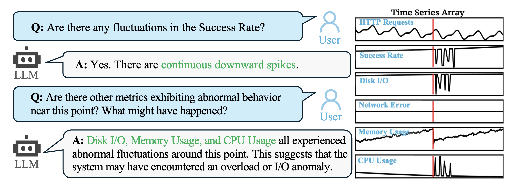

# ChatTS: Understanding, Chat, Reasoning about Time Series with TS-MLLM
`ChatTS` focuses on **Understanding and Reasoning** about time series, much like what vision/video/audio-MLLMs do.
This repo provides code, datasets and model for `ChatTS`: [ChatTS: Aligning Time Series with LLMs via Synthetic Data for Enhanced Understanding and Reasoning](https://arxiv.org/pdf/2412.03104).

Here is an example of a ChatTS application, which allows users to interact with a LLM to understand and reason about time series data:


## Introduction
This repository provides several toolkits for generating synthetic data with the approaches introduced in `ChatTS`, as well as the evaluation code and evaluation datasets for reproduction:
- Toolkits for generating synthetic time series data and the corresponding attribues: `chatts/ts_generator.py`.
- Example code for generating a training dataset with pre-defined templates: `chatts/generate_template_qa.py`, which can be further used as seed QAs for TSEvol.
- Example code for generating a training dataset with LLMs: `chatts/generate_llm_qa`, which can be further used as seed QAs for TSEvol.
- Code implementation for `TSEvol` with the generated seed QAs: `chatts/evol/evol_instruct.py`.
- Code implementation for evaluation: `evaluation/`.
- A trained `ChatTS` model and evaluations datasets (Refer to the section below for more details).
- A simple demo for inference: `demo.ipynb`.
- Training scripts for training your own model.

We also provide the evaluation datasets collected by us. You can download the evaluation datasets from [](https://doi.org/10.5281/zenodo.14349206). The training scripts can be found in [ChatTS-Training](https://github.com/xiezhe-24/ChatTS-Training).
A fine-tuned `ChatTS` model have been open-sourced at [HuggingFace](https://huggingface.co/bytedance-research/ChatTS-14B). You can download and try it!

## How To Use
### Installation
- Basic requirements for model inference: `python>=3.11`, `deepspeed`, `vllm`, `flash-attn` (refer to `requirements.txt`).
- Download the evaluation datasets from [Zenodo](https://doi.org/10.5281/zenodo.14349206) and put them under `evaluation/dataset` (`evaluation/dataset/dataset_a.json` and `evaluation/dataset/dataset_b.json`).
- Download the trained model weights from [HuggingFace](https://huggingface.co/bytedance-research/ChatTS-14B), extract it and put all the extracted files under `ckpt/` (`ckpt/config.json`, etc).
- **Note:** `ChatTS` is trained based on a 14B-sized base model, so you need to ensure that you have a GPU with sufficient memory for inference. Additionally, due to the model's requirements, `Flash-Attention` (https://github.com/Dao-AILab/flash-attention) is essential, so you need to ensure that your GPU meets the installation requirements for Flash-Attention. Recommended GPUs: A100/A800.

### Try the ChatTS Model
- Following the steps in `Installation` to download the trained `ChatTS` model and place it under `ckpt`. 
- The ChatTS model can be loaded directly using the `transformers` library. However, due to the time series data as input, the API usage differs from the standard implementation. **Refer to `demo.ipynb` for more information.**
- **About `sp` Encoding.** To facilitate the input of variable-length batch time series, we adopted a method named `sp` encoding when encoding the time series. For each time series data point, an additional numerical value of 1.0 is added as a mask. For convenience, we have provided a series of functions to normalize and convert the time series and text (Value-Preserved Time Series Encoding). Please refer to `demo.ipynb` for more information about their usage. 
- An example usage of ChatTS:
```python
from transformers import AutoModelForCausalLM, AutoTokenizer
import torch
import numpy as np
from chatts.encoding_utils import eval_prompt_to_encoding

# Load the model
model = AutoModelForCausalLM.from_pretrained("./ckpt", trust_remote_code=True, device_map=0, torch_dtype='float16')
tokenizer = AutoTokenizer.from_pretrained("./ckpt", trust_remote_code=True)

# Create time series and prompts
timeseries = np.sin(np.arange(256) / 10) * 5.0
timeseries[100:] -= 10.0
prompt = f"I have a time series length of 256: <ts><ts/>. Please analyze the local changes in this time series."
prompt, timeseries = eval_prompt_to_encoding(prompt, [timeseries], 'sp')

# Tokenize and convert to tensor
inputs = tokenizer([prompt], return_tensors="pt", padding=True, truncation=True).to(device=0)
timeseries = torch.tensor(timeseries, dtype=torch.float16, device=0)

# Model Generate
outputs = model.generate(**inputs, timeseries=timeseries, max_new_tokens=300)
print(tokenizer.decode(outputs[0][len(inputs['input_ids'][0]):], skip_special_tokens=True))
```

### Training Data Generation
1. **QA Generation with Templates**. Use `python3 -m chatts.generate_template_qa` to generate a training dataset with pre-defined templates.
2. **QA Generation with LLMs**. You need a downloaded LLM that can be loaded with `vLLM` to perform this step. Set `[LOCAL_LLM_PATH]` in `chatts/generate_llm_qa.py` to a local LLM model (e.g., QWen2.5-32B-Instruct, **NOT ChatTS Model**) and set num_gpus, gpu_per_model accordingly. Use `python3 -m chatts.generate_llm_qa` to generate a training dataset with LLMs.
3. **TSEvol**. You need a downloaded LLM that can be loaded with `vLLM` to perform this step. The datasets generated in Step 1 and Step 2 will be used as seed QAs in TSEvol, so please make sure that you have successfully generated the previous datasets before running TSEvol. Then, refer to the steps in `chatts/evol/evol_instruct.py`:
    1. Set `[LOCAL_LLM_PATH]` in `evol_instruct.py` to the path of a local LLM model (e.g., QWen2.5-32B-Instruct. **NOT ChatTS Model**) for QA generation and set num_gpus, gpu_per_model accordingly in `chatts/evol/evol_instruct.py`.
    2. Run `python3 -m chatts.evol.evol_instruct`.
    3. The output will be saved to the file specified in `OUTPUT_FILE`.

### Deepspeed Model Inference for Evaluation
- We provide a simple script for inference of ChatTS (`chatts/inference_tsmllm_deepspeed.py`) with `deepspeed`. After installing `deepspeed`, please set the `WORKDIR` (the absolute path of the current directory) and the evaluation dataset in the script. Then, run the following command to do the model inference:
```sh
deepspeed --num_gpus [YOUR_NUM_GPUS] --master_port 12345 chatts/inference_tsmllm_deepspeed.py
```
You should find the inference results under `exp/` folder, which will be further used for evaluation.

### Evaluation
- Install `ragas==0.1.9` (https://github.com/explodinggradients/ragas), which is used for evaluating the inductive reasoning results.
- Set the `API_KEY` and `OPENAI_URL` in `evaluation/ragas/config/config.toml` (Refer to https://platform.openai.com/docs/api-reference).
- Run `python3 -m evaluation.evaluate_tsmllm_models` to evaluate `ChatTS` (make sure you have done the model inference before).
- We also provide a simple demo to evaluate the performance of text-based GPT models. After setting your `API_KEY` and `OPENAI_URL` in `evaluation/evaluate_gpt_text_models.py`, run the command `python3 -m evaluation.evaluate_gpt_text_models` to obtain the evaluation results of the text-based GPT model.

### Fine-Tuning Your Own Model
- We provide a simple script for fine-tuning your own TS-MLLM models: https://github.com/xiezhe-24/ChatTS-Training (modified based on [LLaMA-Factory](https://github.com/hiyouga/LLaMA-Factory)). Refer to this repository for more details.

## Evaluation Datasets
- We've provided the two evaluation datasets we gathered, as stated in the paper. You can find them in the `evaluation/dataset` folder. Each sample in these datasets has several parts: `timeseries`, which is the time series data itself; `question`, the query related to the time series; `answer`, the text-form standard answers provided for your reference only; `attributes`, the structured labels used to evaluate results; and `ability_types`, which indicates the types of tasks the question involves.
**Please pay special attention to this**: To cut down on evaluation costs, we've combined different questions that pertain to the same time series into one `question`. We use numbering to tell these different questions apart. So, when you look at the evaluation dataset, the actual count of questions might be more than the number of `timeseries` entries. Another thing to note is that some tasks in inductive reasoning and alignment are grouped together in one question. This is because inductive reasoning tasks often require explaining the physical meanings of time series attributes. 
- The `MCQ2` dataset is sourced from a third-party and is open-source. However, due to licensing restrictions, we are unable to provide it within this repository. You can directly download it via https://github.com/behavioral-data/TSandLanguage.

## Case Studies

In `ChatTS`, we mainly focus on **Understanding and Reasoning** about time series, just like what vision/video/audio-MLLMs do, rather than conducting time series prediction, anomaly detection and classification tasks.
You can try more application scenarios of ChatTS by modifying the time series and the text of questions in `demo.ipynb`! 

## Notes
- You can use the CPU for inference. However, since our current ChatTS model does not implement `kv_cache` (which we plan to implement shortly), the inference speed may be significantly slow.
- `vLLM` inference is not supported currently. You can use `deepspeed` for inference for now.

## Third-Party Dependencies
- QWen (https://github.com/QwenLM/Qwen2.5)
- DeepSpeed (https://www.deepspeed.ai/)
- RAGAS (https://github.com/explodinggradients/ragas)
- VLLM (https://github.com/vllm-project/vllm)
- Flash Attention (https://github.com/Dao-AILab/flash-attention)

## Security
If you discover a potential security issue in this project, or think you may
have discovered a security issue, we ask that you notify Bytedance Security via our [security center](https://security.bytedance.com/src) or [vulnerability reporting email](sec@bytedance.com).

Please do **not** create a public GitHub issue for a security vulnerability.

## License
This project is licensed under the [MIT License](LICENSE).

## Cite
```bibtex
@article{xie2024chatts,
  title={ChatTS: Aligning Time Series with LLMs via Synthetic Data for Enhanced Understanding and Reasoning},
  author={Xie, Zhe and Li, Zeyan and He, Xiao and Xu, Longlong and Wen, Xidao and Zhang, Tieying and Chen, Jianjun and Shi, Rui and Pei, Dan},
  journal={arXiv preprint arXiv:2412.03104},
  year={2024}
}
```
